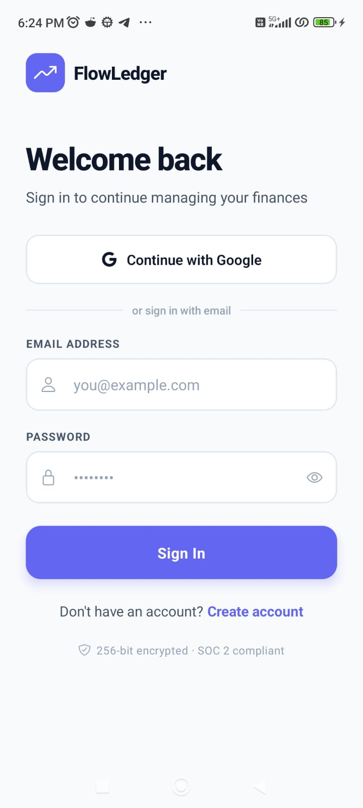
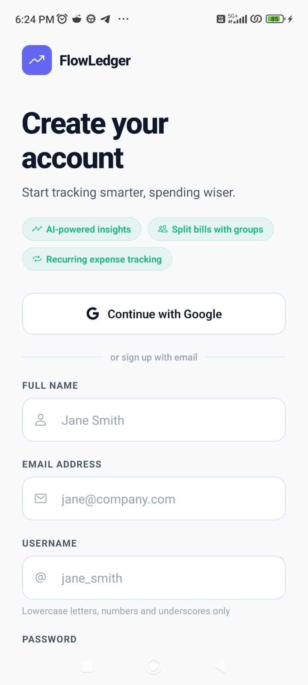
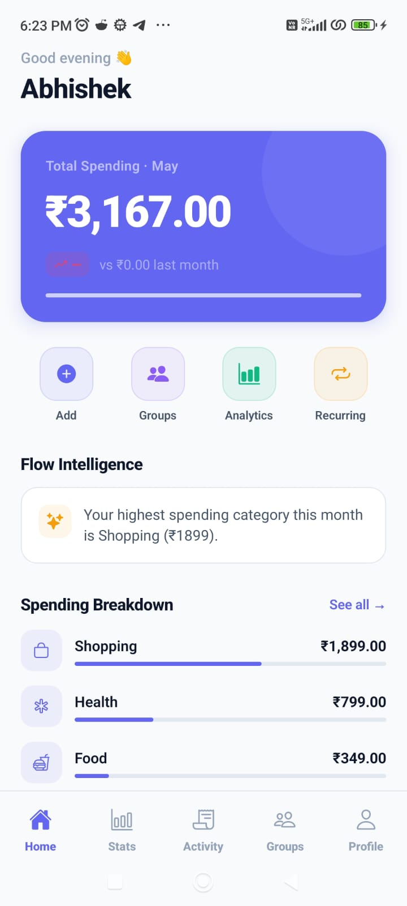
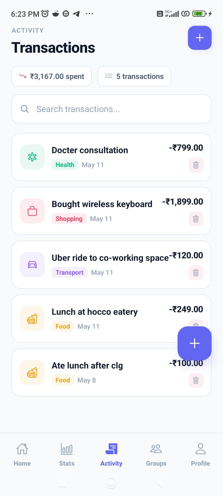
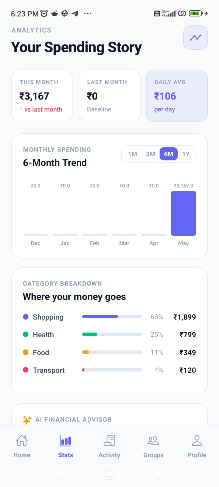
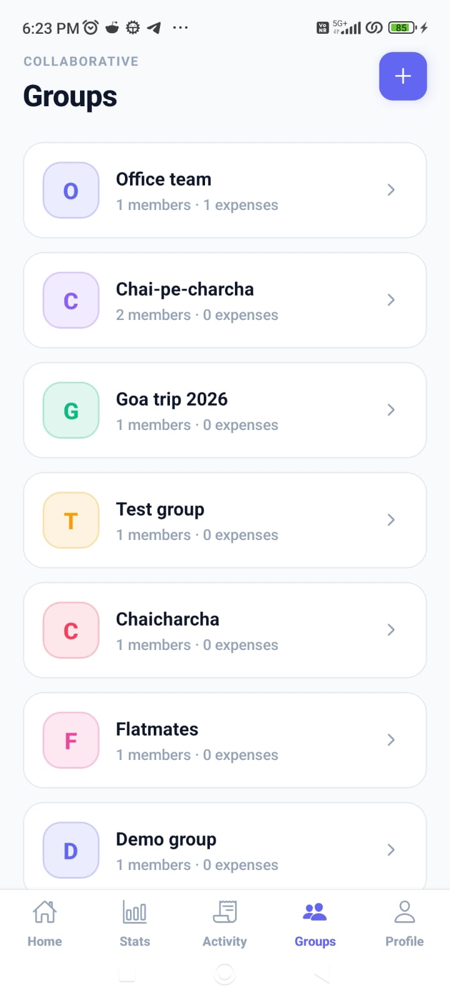
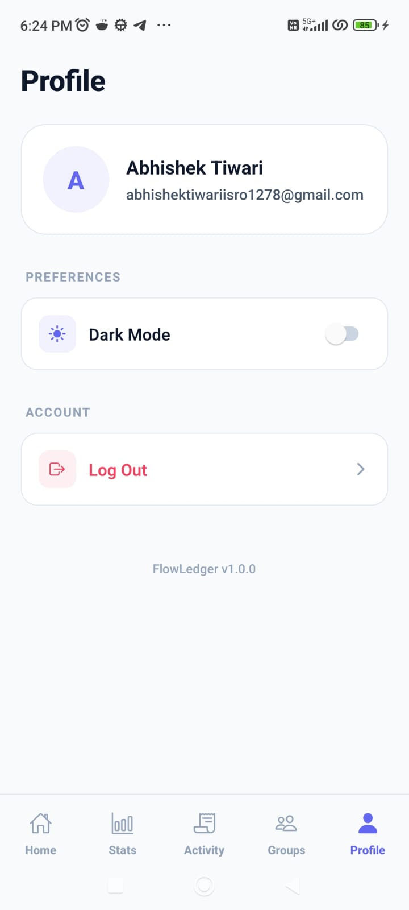

# FlowLedger Mobile — Frontend

> *FlowLedger helps individuals track personal spending and split shared costs with groups — without the complexity of full finance apps.*


This repository contains the React Native/Expo frontend. The API lives in the [FlowLedger backend repo](https://github.com/abhishekjmd/FlowLedger-server).

---

## Demo


| Login | Sign Up | Home |
|:---:|:---:|:---:|
|  |  |  |

| Transactions | Stats | Groups | Profile |
|:---:|:---:|:---:|:---:|
|  |  |  |  |

---

## Features

- Track expenses with amount, category, date, notes, and optional group assignment.
- Search transactions and browse older activity with infinite scrolling.
- Create groups, invite members, and view shared expense activity.
- See who owes whom and record settlements inside group balances.
- Review monthly spending, category breakdowns, trends, and generated insights.
- Switch between light and dark themes with the preference saved on-device.

---

## Tech Stack

| Library | Purpose | Why this choice |
| --- | --- | --- |
| React Native | Mobile UI framework | Delivers native mobile screens while keeping the interface in React. |
| Expo | App runtime and tooling | Simplifies local development, routing setup, native modules, and builds. |
| Expo Router | File-based navigation | Keeps auth, tabs, and group routes easy to follow from the folder structure. |
| TypeScript | Static typing | Catches API and component integration issues before runtime. |
| NativeWind / Tailwind CSS | Styling utilities | Provides consistent spacing and styling patterns across React Native screens. |
| TanStack Query | Server state | Handles caching, pagination, loading states, refetching, and mutation invalidation. |
| Clerk Expo | Authentication | Supports email/password and Google auth with secure mobile session storage. |
| Axios | API client | Centralizes backend requests, timeouts, error handling, and auth headers. |
| React Hook Form + Zod | Forms and validation | Keeps auth and expense forms predictable with schema-backed validation. |
| Gorhom Bottom Sheet | Mobile form surfaces | Makes create/edit flows feel native without leaving the current screen. |
| Expo SecureStore | Local secure storage | Persists auth tokens and theme preference in device-backed storage. |

---

## Folder Structure

```text
flowledger-mobile/
|-- app/                    # Expo Router routes and screen groups
|   |-- (auth)/             # Login, signup, and email verification
|   |-- (groups)/           # Group details and invite flows
|   `-- (tabs)/             # Dashboard, transactions, groups, analytics, profile
|-- assets/                 # App icons, splash images, and static assets
|-- docs/                   # Screenshots and screen recordings
|-- src/
|   |-- api/                # Axios client and API error helpers
|   |-- components/         # Shared app UI components
|   |-- constants/          # Theme colors and shared constants
|   |-- features/           # Feature modules for expenses and analytics
|   |-- hooks/              # Shared hooks for auth, dashboard data, and theme
|   |-- lib/                # App-level utilities such as toast helpers
|   `-- utils/              # Formatting and domain helpers
|-- scripts/                # Project maintenance scripts
|-- app.json                # Expo app configuration
|-- global.css              # NativeWind global styles
|-- metro.config.js         # Metro and NativeWind configuration
|-- tailwind.config.js      # Tailwind/NativeWind theme configuration
`-- package.json            # Scripts and dependencies
```

Routes live under `app/` via Expo Router; all business logic and UI components are colocated under `src/features/`.

---

## State Management

Server state is handled with TanStack Query. Expense, group, dashboard, and analytics hooks define their own query keys, loading behavior, pagination, refetching, and mutation invalidation. Local UI state stays inside screens for search text, selected transactions, active tabs, bottom sheets, and form visibility. Theme is app-wide state managed through a small React context and persisted with Expo SecureStore because it needs to survive app restarts without a heavier global store.

---

## Getting Started

Clone the frontend repo:

```bash
git clone https://github.com/abhishekjmd/FlowLedger-mobile.git
cd FlowLedger-mobile
npm install
```

Create a `.env` file in the project root:

```env
EXPO_PUBLIC_CLERK_PUBLISHABLE_KEY=pk_test_your_clerk_publishable_key
```

Run the Expo development server:

```bash
npm start
```

Run on a specific platform:

```bash
npm run android
npm run ios
npm run web
```

Run linting:

```bash
npm run lint
```

The app currently points to the hosted API at `https://flowledger-server.onrender.com/v1` in `src/api/client.ts`. To test against a local backend, update `BASE_URL` in that file — make sure the [FlowLedger server](https://github.com/abhishekjmd/FlowLedger-server) is running first.

---

## Challenges & Learnings

- Authenticated API calls needed fresh Clerk JWTs on every request, so the Axios client stores a token getter rather than a single token value. This avoids stale-token and startup race issues.
- Transaction browsing needed to stay responsive on mobile, so the app uses paginated TanStack Query data, pull-to-refresh, cached loading states, and targeted invalidation after mutations.
- Group splitting creates several UI edge cases, including empty groups, invite links, member balances, settlements, and adding an expense with a preselected group.

---

## Roadmap

- Recurring expense tracking for subscriptions and repeat payments.
- Push notifications for group settlement reminders.
- Export filtered transactions as CSV.
- Biometric authentication (Face ID / fingerprint) for app unlock.
- Offline support with optimistic UI and background sync.
